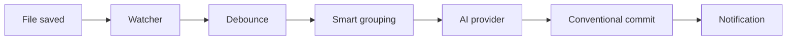

<div align="center">
  

  # GitPilot

  **Every save, a meaningful commit.**

  AI-powered auto-committer · Zero-config · Private by default · Offline-capable

  <p>
    <a href="https://pypi.org/project/gitpilot-ai/"></a>
    <a href="https://pypi.org/project/gitpilot-ai/"></a>
    <a href="https://github.com/alexwakrod/gitpilot/actions/workflows/ci.yml"></a>
    <a href="https://codecov.io/gh/alexwakrod/gitpilot"></a>
    <a href="https://github.com/alexwakrod/gitpilot/blob/main/LICENSE"></a>
  </p>

  <p>
    <a href="#quick-start">Quick Start</a> ·
    <a href="#features">Features</a> ·
    <a href="#how-it-works">How It Works</a> ·
    <a href="#cli-reference">CLI</a> ·
    <a href="#configuration">Configuration</a> ·
    <a href="#roadmap">Roadmap</a>
  </p>
</div>

---

GitPilot watches your Git repositories and turns every save into a meaningful, [Conventional Commit](https://www.conventionalcommits.org/) — automatically. It runs as a quiet background daemon, works with cloud or fully local AI, and **never sends your code off-machine unless you tell it to**.

```diff
- git commit -m "fix stuff"              # manual, vague, easy to forget
+ feat(login): add password reset flow   # written for you, every time
```

<div align="center">
  <!-- Uncomment once assets/demo.gif is recorded (vhs or asciinema recommended)
  
  -->
  <sub>🎬 Live demo coming soon</sub>
</div>

---

## Why GitPilot?

| Without GitPilot | With GitPilot |
| --- | --- |
| You remember to commit… sometimes | Every save becomes a commit |
| `git commit -m "updates"` | Branch-aware, scoped messages like `fix(api): handle null response` |
| Ten trivial commits for one change | Smart grouping collapses related files into one commit |
| Context lost between sessions | A complete, searchable, meaningful history |
| Another tool to configure | One command install, one wizard, done |

---

## Quick Start

**1 — Install**

```bash
pip install gitpilot-ai
```

**2 — Install the daemon and run the setup wizard**

```bash
gitpilot install-service && gitpilot setup
```

**3 — Done.** GitPilot is now watching your chosen projects. Type `gitpilot` anytime to open the live dashboard.

> **Windows:** run the same commands in PowerShell as Administrator.

<details>
<summary><strong>Alternative: install script</strong></summary>

```bash
curl -fsSL https://raw.githubusercontent.com/alexwakrod/gitpilot/main/install.sh | bash
```

</details>

<details>
<summary><strong>Alternative: Docker</strong></summary>

```bash
docker-compose up -d
docker exec -it gitpilot-daemon gitpilot setup
```

</details>

---

## How It Works



1. **Watch** — `watchdog` observes every registered project recursively, ignoring `.git` internals, swap files, and duplicate events.
2. **Debounce** — changes settle for a configurable quiet period (default `120s`).
3. **Group** — related files (same directory, similar names) collapse into a single logical change.
4. **Write** — the active AI provider drafts a branch-aware Conventional Commit message.
5. **Commit** — git executes with automatic retry; Discord is notified if enabled.

---

## Features

### Automatic watching

Register any project with `gitpilot add /path/to/project` — or pick directories visually in the TUI. GitPilot watches recursively and filters out the noise so you never think about it again.

### AI commit messages, your way

Every message follows the Conventional Commits spec and respects the active branch:

```
feat(login): add password reset flow
fix(api): handle null response from /users
chore: update dependencies
```

| Provider | Runs where | API key | Offline | Best for |
| --- | --- | --- | :-: | --- |
| **Ollama** | Your machine | Not required | ✅ | Privacy-first and offline work |
| **xAI Grok** | Cloud | Required | — | Default — fast and accurate |
| **OpenAI** | Cloud | Required | — | GPT-class message quality |
| **Anthropic** | Cloud | Required | — | Claude-class message quality |
| **Groq** | Cloud | Required | — | Fast inference at low cost |
| **Qwen (Alibaba)** | Cloud | Required | — | Pay-as-you-go, high limits |

If the AI is unreachable, GitPilot falls back to sensible messages derived from file names — your history is never blocked.

### Smart grouping & debounce

A burst of saves becomes one commit, not ten. Related changes are grouped automatically; the quiet period is fully configurable.

### Notifications (optional)

Configure a Discord webhook per project and every commit posts a rich embed to your channel.

### Interactive TUI

Launch with `gitpilot`:

- **Add / Select Projects** — navigate your filesystem with arrow keys
- **Live Monitor** — real-time commit events streamed over SSE
- **Settings** — change provider, keys, and webhooks without touching a config file

---

## Secure by Default

| Measure | Detail |
| --- | --- |
| 🔒 Local-only IPC | Daemon binds to `127.0.0.1` with a randomly generated bearer token |
| 🔑 Credential storage | Config written with `0600` permissions on Unix |
| 🚫 No open ports | Nothing is ever exposed to the network |
| 🏠 Offline mode | The Ollama provider runs 100% on-device — code never leaves your machine |

---

## CLI Reference

**Everyday**

| Command | Description |
| --- | --- |
| `gitpilot` | Launch the interactive TUI dashboard |
| `gitpilot add <path>` | Register a project for watching |
| `gitpilot status` | List watched projects |
| `gitpilot log <project_id>` | Show recent commit history |
| `gitpilot remove <project_id>` | Stop watching a project |

**Configuration**

| Command | Description |
| --- | --- |
| `gitpilot setup` | Re-run the first-time wizard |
| `gitpilot config-list` | Display all settings |
| `gitpilot config-set <key> <value>` | Change a setting |

**Service**

| Command | Description |
| --- | --- |
| `gitpilot install-service` | Install the daemon as an OS service |
| `gitpilot daemon-status` | Check whether the daemon is running |

> **Planned:** `gitpilot force-commit <project_id>` — trigger a manual commit.

The daemon (`gitpilotd`) starts automatically via `install-service`. To run it manually: `gitpilotd`.

---

## Architecture

```
gitpilot/
├── cli/              # Click + Rich TUI
├── daemon/           # FastAPI + SSE, lifecycle
├── core/
│   ├── watcher.py        # Watchdog, debounce, smart grouping
│   ├── committer.py      # AI provider adapter (strategy pattern)
│   ├── executor.py       # Git operations + retry
│   └── notifications.py  # Discord webhook
├── domain/           # Pydantic models, policies, settings
├── infrastructure/   # SQLite, HTTP client, repositories
└── tests/            # Unit, integration, E2E
```

| Concern | Choice | Why |
| --- | --- | --- |
| Database | Embedded SQLite | Zero extra processes, fast queries |
| IPC | FastAPI over loopback + bearer token | Local-only, secure by default |
| File watching | [watchdog](https://python-watchdog.readthedocs.io/) | Battle-tested, cross-platform |
| AI integration | Strategy-pattern adapter | Swap providers without touching core logic |

**Built with**

<p>
  
  
  
  
</p>

---

## Configuration

Settings live in `~/.gitpilot/config.json` and are editable via the TUI or `gitpilot config-set`.

| Key | Default | Description |
| --- | --- | --- |
| `ai_provider` | `grok` | AI backend: `grok`, `openai`, `anthropic`, `ollama`, `groq`, `qwen` |
| `ai_model` | `grok-2` | Model name passed to the provider |
| `ai_temperature` | `0.5` | Sampling temperature for message generation |
| `debounce_interval` | `120` | Quiet period in seconds before changes are committed |
| `smart_grouping` | `true` | Group related file changes into one commit |
| `branch_aware_messages` | `true` | Include branch scope, e.g. `feat(login): …` |
| `max_commit_retries` | `3` | Retry attempts for failed git operations |
| `discord_webhook_enabled` | `false` | Send commit notifications to Discord |
| `theme` | `dark` | TUI color theme |

<details>
<summary>Full default <code>config.json</code></summary>

```json
{
  "ai_provider": "grok",
  "ai_model": "grok-2",
  "ai_temperature": 0.5,
  "debounce_interval": 120,
  "smart_grouping": true,
  "branch_aware_messages": true,
  "max_commit_retries": 3,
  "discord_webhook_enabled": false,
  "theme": "dark"
}
```

</details>

---

## Development

**Setup**

```bash
git clone https://github.com/alexwakrod/gitpilot
cd gitpilot
python3.11 -m venv .venv
source .venv/bin/activate
pip install -e ".[dev]"
```

**Test** — coverage target ≥ 80%

```bash
pytest --cov=gitpilot --cov-report=term-missing
```

**Package**

```bash
python -m build
```

---

## Roadmap

- [ ] Full-screen **Textual** dashboard with diff viewer
- [ ] Plugin architecture for notifications (Slack, Telegram, email)
- [ ] Remote daemon mode (TLS-secured, team usage)
- [ ] Local-website with multi-agents/interface
- [ ] VScode extension
- [ ] Rollback feature

---

## Community

Questions, ideas, or feature requests? Join the conversation:

<p>
  <a href="https://discord.gg/4NGs3wrkMQ"></a>
</p>

---

## FAQ

<details>
<summary><strong>Does my code ever leave my machine?</strong></summary>

Only if you choose a cloud AI provider (Grok, OpenAI, Anthropic, Groq, Qwen) — and even then, only the diff metadata needed to write the message is sent. Select the **Ollama** provider for a fully offline, 100% on-device experience.

</details>

<details>
<summary><strong>What happens if the AI is unreachable?</strong></summary>

GitPilot generates a sensible fallback message from the changed file names. Your commit history is never blocked by a network issue.

</details>

<details>
<summary><strong>Which platforms are supported?</strong></summary>

Linux, macOS, and Windows. The daemon installs as a native user service on each platform with a single command: `gitpilot install-service`.

</details>

<details>
<summary><strong>Will it create noisy, one-line commits?</strong></summary>

No. Debouncing waits for a quiet period, and smart grouping merges related file changes into a single, well-described commit.

</details>

---

## License

MIT © [Alex Wakrod](https://github.com/alexwakrod)

<div align="center">
  <sub>Built with ❤️ by a developer, for developers.</sub>
</div>